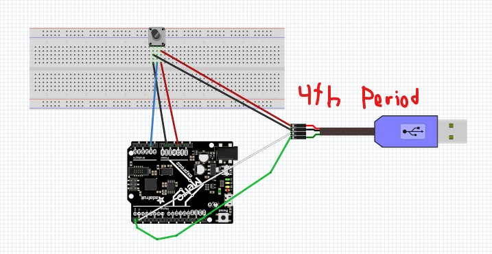
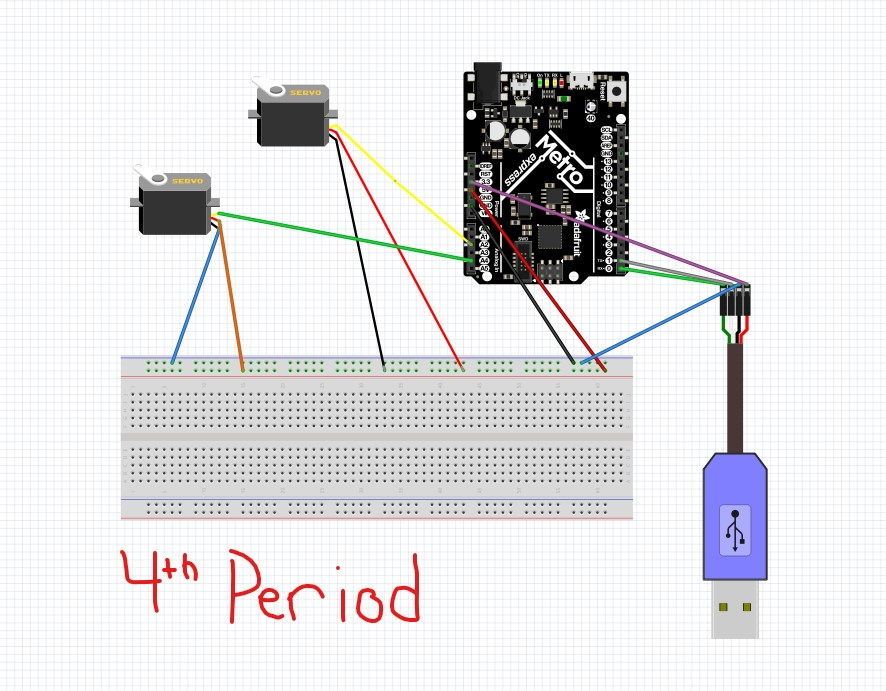

# Expert_CircuitPython
Expert CircuitPython includes the assignments from canvas.

## Hello Processing

### Description

### Lessons Learned

### Images

## CircuitPython to Processing

### Description
This Assignment involved sending CircuitPython potentiometer readings to Processing.

### Lessons Learned
This was my first time ever using a UART and took me a while to understand its function. The UART contaionsI had become soomewhat familiar with Processing because of the first assignment. We learned some new coding commands mostly involved with circular motion. We created a spedometer that correlated to the potentiometer's movement. In order to correlate them we had to map it so I learned how to map in Proscessing which wasn't hard siince it was very similar. 

### Images

## Processing to Circuitpython

### Description
In this assignment we used Proscessing to create a mouse tracker that controled servo's depending on the mouse's location

### Lessons Learned
This assignment was very difficult and took a lot of research and hardwork to try to find a solution. 
### Images

